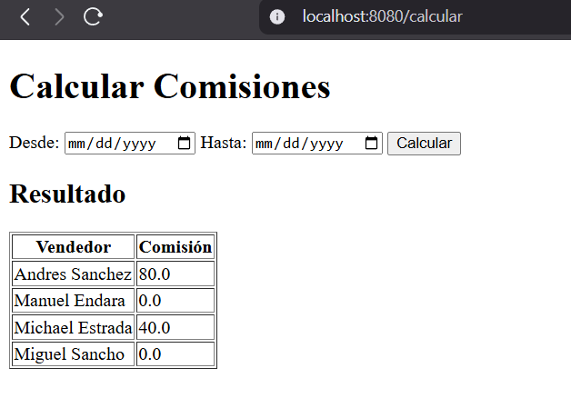

# Video MVC Minicore
## Funcionalidad:
El siguiente codigo tiene como finalidad entregar la siguiente tarea:
El ejercicio de este semestre consiste en que se va tener 3 tablas relacionadas en la base de datos (Vendedor, Ventas y Reglas). Y la funcionalidad principal (mini-core) consiste en filtrar y calcular la comisión de venta en base a un rango de fechas Filtradas .

Para ello utilizamos Spring y Thymeleaf, siendo Thymeleaf una libreria de Spring.

Tambien usamos MySQL, en este caso se utilizo un servidor en la nube como lo es aiven

Utilizamos una vista sencilla en HTML base para el funcionamiento del core:

En este caso lo que hara es tomar una fecha de inicio y una fecha fin la cual tiene como finalidad 
dar la comisión que le corresponda a un cliente, sumando las ventas del vendedor entre esas fechas.

El proyecto se divide en 6 partes:

- Modelos: (Vendedor, venta y regla)
- repositorios: (Usando JPA repository)
- servicios: (Donde se encuentra el core)
- controlador: (Siendo donde se encontrara el servicio y dando a la vista)
- vista: En la carpeta resources, el html sin ningun css
- configuraciones: Como se debe deployar usaremos un Dockerfile y en resources/application.properties
ingresaremos los datos de nuestra base de datos (Puede ser local o en la nube).

Para finalizar una imagen de que funciona correctamente este core:

